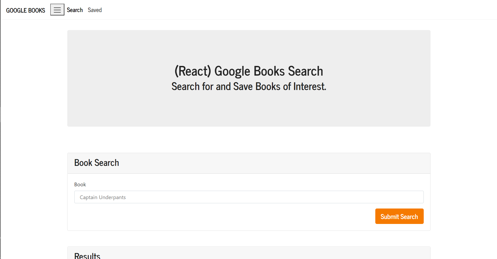
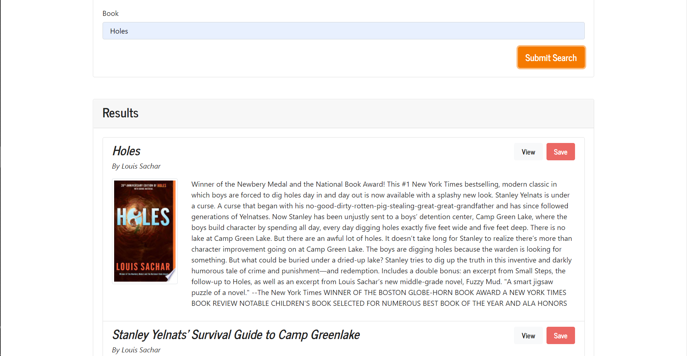
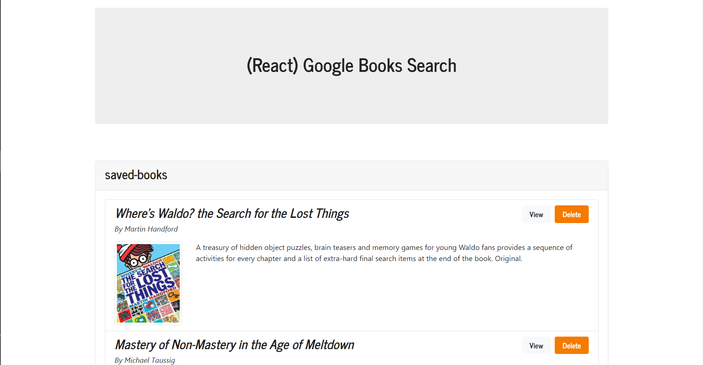

# Google-books-app

    <h4>
    </a>
    
    
        
    </h4>

 

This is an employee directory application.

  <h4>
    <a href="https://github.com/ThomasMullaney/Google-books-app">
      Github Repository
    </a>
 | 
<a href="https://google-books-reading-list-app.herokuapp.com/
">
      Heroku
    </a>
  </h4>

 

 

## Description:

### A MERN stack application that allows users to search for books using a Google API.

## Table of Contents:

1. [Installation](#installation)
2. [Usage](#usage)
3. [License](#license)
4. [Contributing](#contributing)
5. [Tests](#tests)
6. [Questions](#questions)

## Installation:

### npm install & npm start

## Usage:

### Application is CRUD, users can search for books, post them to their personal reading list, and delete them from the reading list when finished.

## License:

### 

## Contributing:

### Tom Mullaney

## Tests:

###

## Questions:

### github.com/ThomasMullaney

### tloring.mullaney@gmail.com
